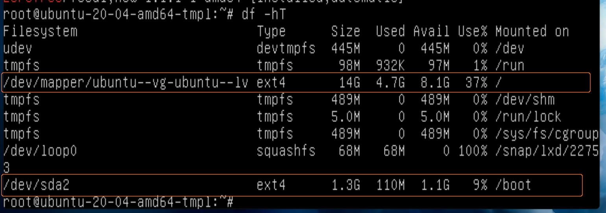

# How to Shrink VirtualBox Virtual Disk File (VDI)

At high level, it requires two major steps:
1. From guest: defrag and zero fill unutilised space of virtual disk.
2. From host: use VirtualBox command tool to shrink the VDI file to actual utilised disk size.

My environment:
- Guest: Ubuntu Server 20.04
- Host: Mac OS 10.14.6 Mojave
- VirtualBox: 6.1.34

Table of contents:
1. [Guest VM: Defrag and Zero Fill Virtual Disk](#openssh-server)
   - [Ubuntu Server Guest](#ubuntu-server-guest)
   - [Windows 7 Guest](#windows-7-guest)
2. [Host: Shrink Virtual Disk VDI File](#host-shrink-virtual-disk-vdi-file)
   - [Mac OS Host](#mac-os-host)


## Guest VM: Defrag and Zero Fill Virtual Disk

### Ubuntu Server Guest

1. Access `Recovery mode` of the Ubuntu guest VM:
   1. Start the guest VM, then log in through the VM main window.
   1. Reboot with command `$ sudo shutdown -r now` and **perform next step quickly**.
   1. While the VM is booting up, press `ESC` key to access **GRUB** boot menu.  
      If missed the timing to access **GRUB** menu, retry by rebooting again.
   1. In GRUB boot menu, choose `Advanced options for Ubuntu`.
   1. Choose to boot with kernel under `recovery mode`. If multiple kernel versions available in menu, choose the latest version.
1. Under Recovery Menu, choose to access `root shell prompt`. Then press `ENTER` key for maintenance.
1. On root shell, run `df -hT` command to list the disks.
   
1. Note down the disk name and type of the interested drive:
   In this example, the 15GB VDI consists of:
   - `/` drive mounted from `ext4` disk `/dev/mapper/ubuntu--vg-ubuntu--lv`.
   - `/boot` drive mounted from `ext4` disk `/dev/sda2`.
1. Install "zerofree" utility if not available. We will use "zerofree" to zero fill unutilised disk space:
   ```bash
   $ sudo apt list --installed | grep zerofree
   
   # install it if not on our system.
   sudo apt-get install zerofree
   ```
1. Run below piped commands. Substitute the disk name and type with what we noted down in step #8.
   ```bash
   $ systemctl stop systemd-journal* && sudo swapoff -a && mount -n -o remount,ro -t ext4 /dev/mapper/ubuntu--vg-ubuntu--lv / && zerofree -v /dev/mapper/ubuntu--vg-ubuntu--lv
   $ systemctl stop systemd-journal* && sudo swapoff -a && mount -n -o remount,ro -t ext4 /dev/sda2 /boot && zerofree -v /dev/sda2
   ```
   Some of these commands must be run quickly right after the previous one, thus we choose to chain them together into single long command.
1. Run `$ halt` command to shut the VM down. When the screen prints `System halted`, close the VM window, then choose `Power off the machine` when prompted with options.

### Windows 7 Guest

1. Start the Windows 7 guest VM.
1. Download "SDelete", a small command line utility. It's part of Microsoft's Sysinternals utility collection:  
   https://docs.microsoft.com/en-us/sysinternals/downloads/sdelete
1. Quit non-essential software from running, if possible.
1. Run "Disk Cleanup" tool from Windows for disk housekeeping.  
   Tip: browser caches may take up quite a lot of space nowadays.
3. Run "Disk Defragmenter" tool from Windows to defragment the virtual disk.
4. Run "SDelete" to zero out free space with command:
   ```
   > sdelete -z C:
   ```
   where `C:` is the disk drive which we want to perform zero-ing operation on.
3. Shut down the VM.


## Host: Shrink Virtual Disk VDI File

### Mac OS Host

1. On host command line, switch to the directory containing the selected VM's VDI file. Take my VM `Ubuntu_20_04_amd64_tmpl` as example:
   ```bash
   $ cd ~/VirtualBox\ VMs/Ubuntu_20_04_amd64_tmpl/
   $ ls -lh
   # ... few other files
   -rw-------  1 shiouming  staff   4.3G May 13 17:54 Ubuntu_20_04_amd64_tmpl.vdi
   ```
1. Run the VirtualBox utility "VBoxManage" with subcommand to shrink the file:
   ```bash
   $ VBoxManage modifyhd --compact Ubuntu_20_04_amd64_tmpl.vdi
   ```
1. Verify the VDI disk file size. In this example, it reduced from 4.3GB to 3.4GB:
   ```bash
   $ ls -lh
   # ... few other files
   -rw-------  1 shiouming  staff   3.4G May 13 18:09 Ubuntu_20_04_amd64_tmpl.vdi
   ```
1. If the VM has snapshots, it is more important to run this command against VDI files in `Snapshots` sub-directory.
